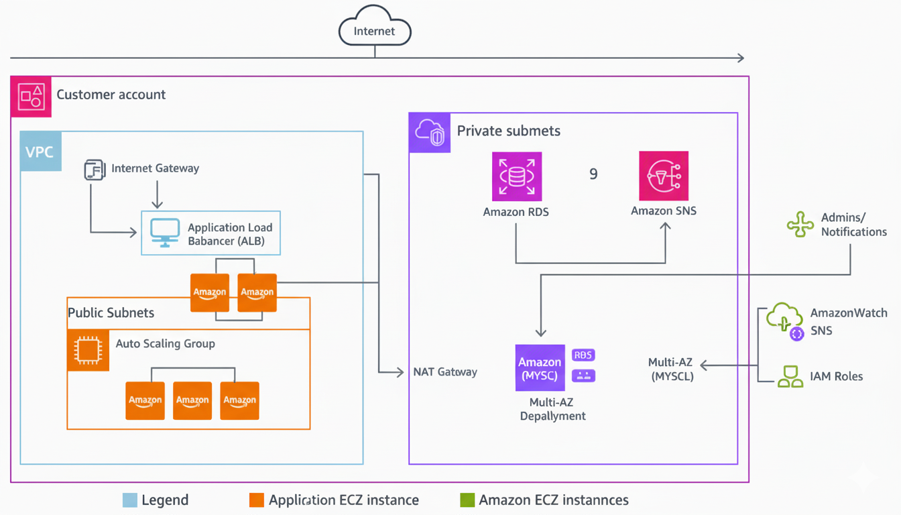

# AWS Web Application Deployment Project

## 📖 Overview
This project demonstrates the deployment of a scalable and highly available static web application on AWS using:
- EC2
- Application Load Balancer
- Auto Scaling Group
- IAM Roles
- CloudWatch & SNS Alerts

---

## 🏗️ Architecture Diagram

---

## ⚙️ Components Used

| Component | Description |
|------------|--------------|
| **EC2** | Hosts the static web application |
| **Load Balancer (ALB)** | Distributes incoming traffic across multiple instances |
| **Auto Scaling Group** | Automatically adjusts the number of instances based on demand |
| **IAM Role** | Provides secure access for instances to AWS services |
| **CloudWatch & SNS** | Monitors performance and sends alerts |
| **S3** *(optional)* | Stores backups or logs |

---

## 🚀 Deployment Steps
1. Launch EC2 Instance and deploy website files.
2. Create a Load Balancer and attach instances via Target Group.
3. Configure Auto Scaling Group linked to Launch Template.
4. Attach IAM Role to EC2 instances.
5. Set up CloudWatch alarms and SNS topics for alerts.

---

## 🔔 Monitoring
CloudWatch alarms are configured to trigger SNS notifications when CPU utilization exceeds thresholds.

---

## 🎥 Demo (Optional)
You can view the live demo here:
➡️ [Live URL](http://mysite-lb-354751140.us-east-1.elb.amazonaws.com)

Or watch the video demonstration:
🎬 [Project Video Link](https://youtu.be/example)

---

## 👩‍💻 Author
**Sharly Fayez**  
Cloud Engineer
